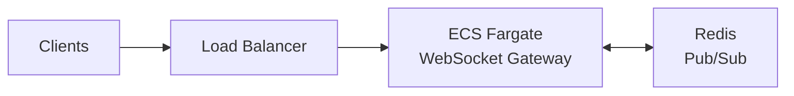

# WebSocket Gateway with Redis


A scalable WebSocket gateway built with Node.js, Redis, and AWS CDK for pub/sub messaging across multiple instances.

## Features
- **WebSocket Server**: Real-time bidirectional communication
- **Redis Pub/Sub**: Message broadcasting across multiple server instances  
- **AWS CDK**: Infrastructure as Code for AWS deployment
- **Docker**: Containerized application for easy deployment

## Architecture



The gateway includes logical services: Chat, Presence, Cursor, and Reaction services that communicate via Redis pub/sub channels.

## Quick Start

### Local Testing
```bash
make dev-detached    # Start development environment
```

### Deployment
```bash
cdk deploy --all     # Deploy infrastructure first (required)
./deploy.sh          # Deploy application
```

## Configuration
- `REDIS_ENDPOINT`: Redis hostname (default: localhost)
- `PORT`: WebSocket server port (default: 8080)

## WebSocket API
```javascript
// Simple message
ws.send("Hello, World!");

// Pub/Sub message
ws.send(JSON.stringify({
  channel: "chat-channel",
  message: "Hello!",
  timestamp: new Date().toISOString()
}));
```

## File Structure
```
├── bin/          # CDK app entry point
├── lib/          # CDK infrastructure code
├── src/          # Application code
│   ├── server.js # WebSocket server
│   ├── core/     # Core services
│   └── services/ # Chat, presence, cursor, reaction
├── test/clients/ # WebSocket test clients
└── Makefile      # Automation commands
```
