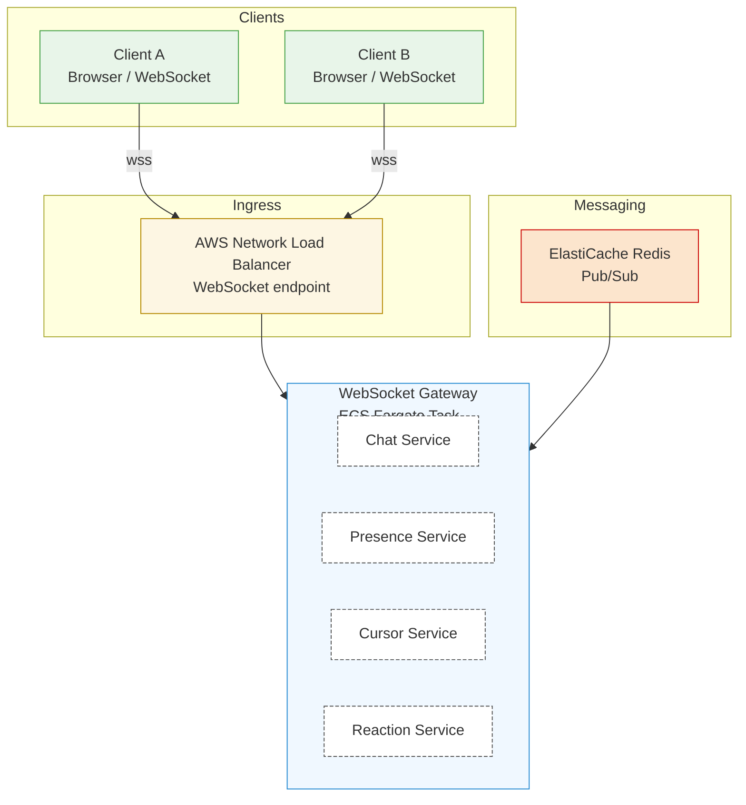
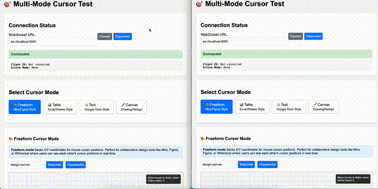

# WebSocket Gateway


A scalable WebSocket gateway built with Node.js, Redis, and AWS CDK for pub/sub messaging across multiple instances.

## Features
- **WebSocket Server**: Real-time bidirectional communication
- **Redis Pub/Sub**: Message broadcasting across multiple server instances  
- **AWS CDK**: Infrastructure as Code for AWS deployment
- **Docker**: Containerized application for easy deployment

## Architecture


```mermaid
flowchart TD
  classDef awsNLB fill:#fdf6e3,stroke:#b58900
  classDef awsECS fill:#f0f8ff,stroke:#268bd2
  classDef awsRedis fill:#fce5cd,stroke:#cc0000
  classDef client fill:#e8f5e9,stroke:#43a047
  classDef logic fill:#ffffff,stroke:#555,stroke-dasharray: 4 2

  subgraph Clients
    ClientA[Client A<br/>Browser / WebSocket]
    ClientB[Client B<br/>Browser / WebSocket]
  end
  class ClientA client
  class ClientB client

  ClientA -->|wss| NLB
  ClientB -->|wss| NLB

  subgraph Ingress
    NLB[AWS Network Load Balancer<br/>WebSocket endpoint]
  end
  class NLB awsNLB

  NLB --> ECS

  subgraph ECS[WebSocket Gateway<br/>ECS Fargate Task]
    Chat[Chat Service]
    Presence[Presence Service]
    Cursor[Cursor Service]
    Reaction[Reaction Service]
  end
  class ECS awsECS
  class Chat,Presence,Cursor,Reaction logic

  subgraph Messaging
    Redis[ElastiCache Redis<br/>Pub/Sub]
  end
  class Redis awsRedis

  Redis --> ECS

```




The gateway includes logical services: Chat, Presence, Cursor, and Reaction services that communicate via Redis pub/sub channels.

## Development

### Local Dev (no AWS required)

Runs the gateway + Redis in Docker with fake Cognito credentials. Auth rejects all tokens — useful for observing logs and server behaviour without connecting clients.

```bash
make dev-local        # start gateway + Redis
make dev-local-stop   # stop
```

**URLs:**
| Endpoint | URL |
|----------|-----|
| Health | http://localhost:8080/health |
| Cluster info | http://localhost:8080/cluster |
| Stats | http://localhost:8080/stats |

---

### AWS Testing (real Cognito auth)

Runs the gateway locally against your real AWS Cognito user pool. Generates a test user automatically — no credentials to manage.

**First time setup:**
```bash
make gen-env    # discovers Cognito pool, creates test user, writes .env.real
```

**Every run:**
```bash
make dev-real   # starts Redis (Docker), starts gateway, fetches JWT, prints wscat command
```

Output includes a ready-to-use connect command:
```
wscat -c "ws://localhost:8080?token=<JWT>"
```

**Send a message once connected:**
```bash
{"service":"chat","action":"send","channel":"public:test","data":{"text":"hello"}}
```

**URLs:**
| Endpoint | URL |
|----------|-----|
| Health | http://localhost:8080/health |
| Cluster info | http://localhost:8080/cluster |
| Stats | http://localhost:8080/stats |
| WebSocket | ws://localhost:8080?token=\<JWT\> |

**Re-run `make gen-env` any time to:**
- Rotate test credentials
- Pick up new infrastructure after `cdk deploy`

---

### Deployment
```bash
cdk deploy --all     # Deploy infrastructure
```

## Configuration

### Required Environment Variables
- `COGNITO_REGION`: AWS region for Cognito
- `COGNITO_USER_POOL_ID`: Cognito user pool ID
- `REDIS_ENDPOINT`: Redis hostname (default: localhost)
- `PORT`: WebSocket server port (default: 8080)

### Optional Features

#### IVS Chat (Persistent Chat with Moderation)

By default, the gateway uses ephemeral in-memory chat with 100 messages per channel stored in an LRU cache. For persistent chat history and content moderation, enable AWS IVS Chat integration.

**To enable:**
1. Deploy IVS Chat stack: `cdk deploy IvsChatStack`
2. Set environment variable: `IVS_CHAT_ROOM_ARN=<room-arn-from-cdk-output>`
3. Redeploy gateway: `cdk deploy WebSocketGatewayStack --force`

**What it provides:**
- Persistent chat history (stored in AWS IVS backend)
- Lambda-based content moderation (profanity filtering)
- Message delivery guarantees
- Cost: ~$1.62 per 1M messages (vs $0 for in-memory)

**Migration:** To preserve existing in-memory chat history when enabling IVS Chat, see `scripts/migrate-chat-to-ivs.js`

**Full deployment guide:** [.planning/phases/05-enhanced-reliability-optional/IVS-DEPLOYMENT.md](.planning/phases/05-enhanced-reliability-optional/IVS-DEPLOYMENT.md)

## WebSocket API
```javascript
// Simple message
ws.send("Hello, World!");

// Pub/Sub message
ws.send(JSON.stringify({
  channel: "chat-channel",
  message: "Hello!",
  timestamp: new Date().toISOString()
}));
```

## File Structure
```
├── bin/          # CDK app entry point
├── lib/          # CDK infrastructure code
├── src/          # Application code
│   ├── server.js # WebSocket server
│   ├── core/     # Core services
│   └── services/ # Chat, presence, cursor, reaction
├── test/clients/ # WebSocket test clients
└── Makefile      # Automation commands
```
